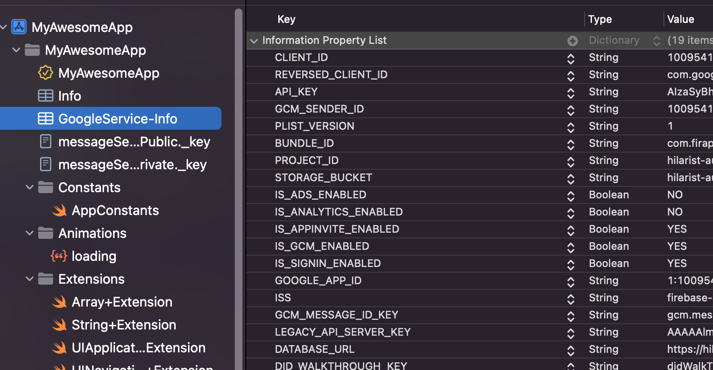
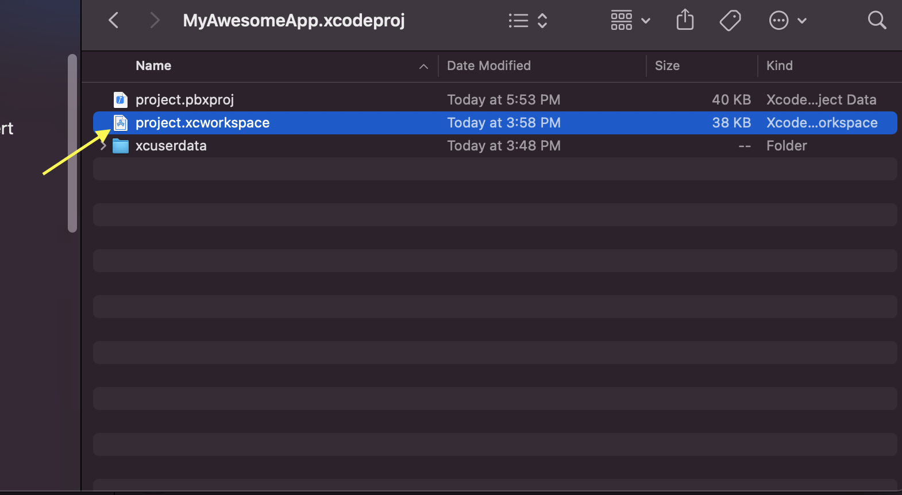

# Get Up and Running with the SwiftUI+Firappuccino iOS AppStarter Template

**Last Updated:** September 17, 2022 

Current Template Version**: `v0.1.1-alpha`** 

**Table of Contents**

# Hardware

- MacBook Pro (16-inch, 2019), 2.4 GHz 8-Core Intel Core i9, 64 GB 2667 MHz DDR4, AMD Radeon Pro 5500M
- iPhone XS

# Tools

- macOS 12.6
- Xcode 14
- iPhone 14, iPhone 14 Pro (Simulator)
- iOS 16
- Swift 5.6
- Swift Package Manager
- swift-tools-version: 5.5

# STEP 1: Copy the template

> To get started, you’ll clone the template to a new repository in you Github account.
> 

From the template repository’s main page:

1. Click `Use this template` button.


1. On the next screen, choose the repo owner from the dropdown.
2. Enter a name for your new repo/app 
3. Select the visibility for your new repo
4. Click the `Create repository from template`button.

<aside>
💡 Make sure to leave the `include all branches` checkbox in the *unchecked* state*.*

</aside>


# STEP 2: Configure your new Github repository

> Next you’ll make a few changes to your new repo
> 

### Create a new “main” branch

1. Click on the `branch` dropdown menu
2. Enter a name for the new branch
3. Click on `Create branch` to create the new branch.


### Update the default branch

From the `Settings` tab:

1. Click on the `Branches` tab in the `Settings`side menu
2. Click on the “change branches” icon in `Default Branch`  settings pane.
3. Select the new default branch from the dropdown and click the `Update` button.


1. Confirm the update when the alert appears.


# STEP 3: Clone your template locally

> Next, you’ll clone the repo to your local environment to complete the final steps to get your new app up and running!
> 

Use the method of your choice to clone your repository locally

- Command Line
    - Open a Terminal window and navigate to your desired root folder
    - Use the following command to clone the repo, substituting the correct path to your repo.

```bash
git clone https://github.com/path-to-your-repo.git
```

- Git Client
    - YMMV


# STEP 4: Rename the Xcode project locally

> In this step, you’ll rename things locally to match your repo/app, but first let’s clean out Xcode cruft to avoid any potential issues…
> 

<aside>
💡 Xcode makes this process more complicated than it needs to be - but, if you follow these steps, everything will go smoothly!

</aside>

1. Open Xcode > Preferences and then select the `Locations` tab from the finder window that appears.
2. Click on the arrow to the right of the path to the parent folder.  When the finder window appears, close Xcode again and then drag the whole `DerivedData` folder to the trash. Permanently delete the folder / empty the trash.


1. Open your project’s root folder and double-click the `[AppStarter.xcodeproj](http://AppStarter.xcodeproj.to)` to open the project in Xcode


1. Once the package dependencies finish resolving, clean build folder using `Shift+Command+K`


1. Rename the Project in the `Identity and Type` pref pane and hit return.


1. When the confirmation dialog appears, click on the `Rename` button if everything looks good.


1. Next update project folder to reflect the new project name by clicking on the folder and editing it in the `Identity and Type` prefs panel.


1. In the same fashion, update your `.entitlements` file as well.


1. If all went well, you should be looking at something similar to this:


1. There’s still a few renames to perform, so to make it easy you can use Xcode’s search pane using the term “AppStarter” to hunt them down.


1. The last item remaining in your search should be the project BundleID, which you can change project-wide in the Target’s `Signing and Capabilities` tab. 


1. Run another search. If all went well it should come up empty.


1. Next, you’ll rename your schemes. From `Manage Schemes`, click on the title and hit return to edit the name, then click the `Close` button to save the changes.


1. Next you’ll need to choose your signing team to validate your entitlements. The warning should disappear.


<aside>
💡 The next few steps assume that you have already created and set-up your app in Firebase Console.  If you haven’t done this yet, please refer to this [page](https://www.notion.so/Basic-Firebase-Setup-for-the-SwiftUI-Firappuccino-iOS-AppStarter-Template-16410cbc5b3443b3bcc2c420bb9b9eac) for instructions before proceeding.

</aside>

1. Next, select the `Google-Info.plist` file in the `File Inspector` and replace the placeholder values with valid ones from the `Google-Info.plist` you downloaded after creating your Firebase App. 




1. Update custom `URLTypes` in the `Info` tab for your target by replacing the placeholder portion of the text with the second portion of your `REVERSED_CLIENT_ID`


1. Clean your build folder with `Shift+Command+K` then build the project with `Command+B`.   Then, close Xcode.
2. Navigate to your project folder, `Control+Click` on your `.xcodeproj` and select “*Show Package Content*s”. Drag the file to the trash, permanently delete or empty trash.




1. Open your app in Xcode and clean the build folder again with `Shift+Command+K` and then open the `Signing and Capabilities` tab for your app target. Scroll down to the Keychain Sharing section and click the + button.  Your bundleID should auto-populate the field.


1. `Reset Package Cache`, then `Update to Latest Package Versions`.  *Build* and *Run*.


# STEP 5: Push changes to remote repository

> Your app is now configured and running. That was pretty painless right? On to some final housekeeping…
> 

1. Using your method of choice, commit and push your local changes and go build something awesome!


1. Go EXPERIMENT and build cool stuff…


